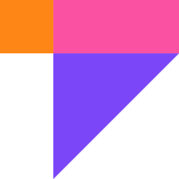

# 🎨 Prosy — Modern Portfolio & Deck Builder

<p align="center">
  
</p>

<p align="center">
  <strong>A modern, browser-native portfolio and slide deck editor built for creators, designers, and developers.</strong>
  <br />
  Design stunning multi-page portfolios, presentations, and visual documents — then export to <strong>100% fully editable PowerPoint (.pptx)</strong>, print-ready PDF, or high-res images.
</p>

<p align="center">
  
  
  
  
  
</p>

---

## ✨ Key Features

### 📄 100% Fully Editable PowerPoint (.pptx) Export
Unlike standard tools that export flattened image screenshots into slides, **Prosy** decomposes each canvas page into genuine, native PowerPoint objects:
- **Native Editable Textboxes**: Retains font family (Inter, Space Grotesk, Poppins, etc.), font size, hex colors, bold/italic formatting, and text alignments. Double-click to re-type words in PowerPoint, Apple Keynote, or Google Slides!
- **Native Vector Shapes**: Cards, buttons, circles, avatars, and divider lines export as native vector shapes (`rect`, `roundRect`, `ellipse`, `line`) with fill color, opacity, and border strokes.
- **Standalone Image Layers**: Photos and masked images remain moveable, resizable layers rather than locked graphics.
- **Clickable Hyperlinks**: Links attached to buttons and texts remain functional during slideshows.

### ✍️ Multi-Selection Typography Editing
- Select multiple text objects at once (via **Shift + Click** or **Marquee Drag**).
- **Batch Font Family**: Change font families across all selected texts simultaneously with live Google Fonts preloading.
- **Proportional Scaling (`A-` / `A+`)**: Increase or decrease font size by 2px proportionally, preserving heading vs body typographic hierarchy.
- **Batch Styling**: Uniformly toggle Bold, Italic, Underline, text alignments, fill color, line height, and letter spacing.

### 🔤 Curated Google Fonts Engine
- 49 curated typefaces across **Sans Serif**, **Serif**, **Display**, **Mono**, and **Handwritten** styles.
- **Live Typeface Previews**: Font picker dropdown preloads font definitions so every font family name renders in its genuine typeface.
- Asynchronous font loader ensures text metrics (`initDimensions()`) and selection boxes calculate accurately.

### 🖼️ Photo Clipping & Vector Masking
- Clip images into any geometric shape (`rect`, `circle`, `ellipse`, `path`) with automatic cover-crop scaling.
- **In-Place Image Swapping**: Replace photos in existing clipped masks without destroying the frame or changing layer order.
- **Layer Preservation**: Clipped shapes maintain their exact z-index position on the page without burying overlying badges, titles, or buttons.

### 📐 Smart Snapping & Guides
- Real-time magnetic snapping to canvas center, margins, and sibling object edges.
- Dynamic distance indicators and alignment guidelines.
- Fluid canvas pan and zoom (`Ctrl + Wheel` or Spacebar drag).

### 🖥️ Fullscreen Presentation Mode
- Instant full-screen slide deck preview with keyboard navigation (`←` / `→` or `Space`).
- Smooth transitions between portfolio slides, ideal for client walk-throughs and design reviews.

### 📦 Curated Portfolio Template Packs
Includes production-grade editorial template packs ready to customize:
- **Digital Portfolio** (Minimal, type-led portfolio with electric blue accents)
- **Lumina Folio** (Clean Swiss editorial style with crisp borders and cobalt accents)
- **Aurelia & Co.** (Warm terracotta editorial & luxury branding)
- **Neo Studio** (High-contrast tech studio showcase)
- **DSM Kinetic** (Dark mode void cards & cyber typography)
- **Jost Brand** (Warm ink and cream brand guidelines)
- **Rayo Fashion** (Soft blush & editorial lookbook layout)
- **Studio Today** (Vibrant agency deck)

---

## 🚀 Getting Started

### Prerequisites
- [Node.js](https://nodejs.org/) (version 18 or higher recommended)
- [npm](https://www.npmjs.com/) or [pnpm](https://pnpm.io/)

### Installation

```bash
# Clone repository
git clone git@github.com:keliksa30/prosy.git

# Navigate to project directory
cd prosy

# Install dependencies
npm install
```

### Running Locally

```bash
# Start Vite development server
npm run dev
```

Open [http://localhost:5173/](http://localhost:5173/) in your browser.

### Building for Production

```bash
# Compile and bundle assets into /dist
npm run build

# Preview production build locally
npm run preview
```

---

## ⌨️ Keyboard Shortcuts

| Shortcut | Action |
| :--- | :--- |
| **V** | Select Tool |
| **H** / **Spacebar + Drag** | Hand / Pan Tool |
| **T** | Text Tool |
| **R** | Rectangle Tool |
| **O** | Ellipse / Circle Tool |
| **L** | Line Tool |
| **⌘ / Ctrl + Z** | Undo |
| **⌘ / Ctrl + ⇧ + Z** | Redo |
| **⌘ / Ctrl + C** | Copy |
| **⌘ / Ctrl + V** | Paste |
| **⌘ / Ctrl + G** | Group Objects |
| **⌘ / Ctrl + ⇧ + G** | Ungroup Objects |
| **Backspace / Delete** | Delete Selected Object |
| **F** | Toggle Fullscreen Presentation Mode |
| **Escape** | Deselect / Exit Tool |

---

## 📂 Project Architecture

```text
prosy/
├── assets/                  # Brand assets & logos
├── public/                  # Static web assets & favicons
├── src/
│   ├── core/                # Core engines
│   │   ├── CanvasManager.js     # Fabric canvas lifecycle & viewport
│   │   ├── EditorApp.js         # Central application orchestrator
│   │   ├── ExportManager.js     # Native PPTX, PDF, and PNG export engine
│   │   ├── HistoryManager.js    # Multi-state Undo/Redo stack
│   │   ├── KeyboardManager.js   # Global hotkeys & shortcut mappings
│   │   ├── ObjectOps.js         # Vector operations, masking & grouping
│   │   ├── PageManager.js       # Multi-page portfolio management
│   │   ├── PresentationMode.js  # Fullscreen slide presentation runner
│   │   ├── SmartGuides.js       # Figma-style alignment snapping lines
│   │   └── fonts.js             # Google Fonts dynamic loader & catalog
│   ├── panels/              # Sidebar & floating UI panels
│   │   ├── ElementsPanel.js     # Pre-designed UI blocks & components
│   │   ├── FilmstripPanel.js    # Bottom page thumbnails & reordering
│   │   ├── IconsPanel.js        # Lucide vector & social media brand icons
│   │   ├── LayersPanel.js       # Visual layer stack & z-ordering
│   │   ├── PhotosPanel.js       # Free stock photos & local photo library
│   │   └── PropertiesPanel.js   # Design inspector (Typography, Fill, Stroke)
│   ├── templates/           # Editorial portfolio packs
│   │   ├── TemplateManager.js   # Template loader & page applicator
│   │   └── data/                # Ready-to-use portfolio packs (JSON)
│   ├── tools/               # Canvas interaction tools (Select, Text, Shape, Hand)
│   ├── ui/                  # Reusable UI controls, modals & icon renderers
│   ├── styles/              # Design tokens, variables & layout CSS
│   └── main.js              # Application entry point
├── tests/                   # Automated Playwright test specifications
├── package.json
└── vite.config.js
```

---

## 📤 Export Formats

| Format | Description |
| :--- | :--- |
| **Native PowerPoint (.pptx)** | Fully editable presentation slides with native textboxes, vector shapes, images, and links. |
| **High-Resolution PDF (.pdf)** | Print-ready multi-page PDF document exported at crisp 300 DPI. |
| **Raster Images (.png / .webp)** | Clean single-page exports for social media previews and web portfolios. |
| **Prosy Project (.prs)** | Lightweight JSON file saving all pages, layout data, custom tags, and fonts for full session persistence. |

---

## 📄 License

This project is licensed under the [MIT License](LICENSE).
Feel free to use, modify, and distribute it for personal and commercial portfolios.
